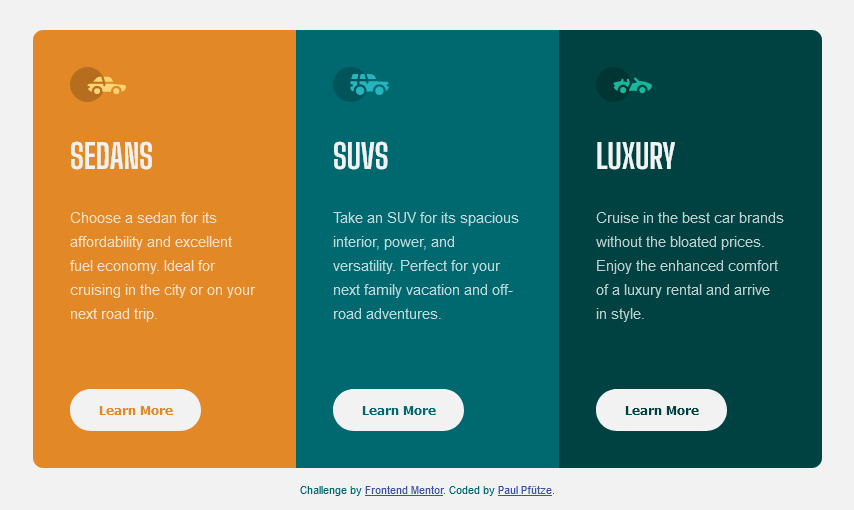
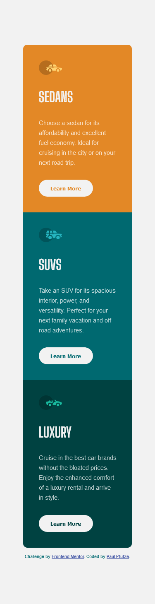

# Frontend Mentor - 3-column preview card component solution

This is a solution to the [3-column preview card component challenge on Frontend Mentor](https://www.frontendmentor.io/challenges/3column-preview-card-component-pH92eAR2-).

## Table of contents

- [Overview](#overview)
  - [The challenge](#the-challenge)
  - [Screenshot](#screenshot)
  - [Links](#links)
- [My process](#my-process)
  - [Built with](#built-with)
  - [What I learned](#what-i-learned)
  - [Useful resources](#useful-resources)
- [Author](#author)

## Overview

### The challenge

Users should be able to:

- View the optimal layout depending on their device's screen size
- See hover states for interactive elements

### Screenshot

### Links

- Solution URL: [https://www.frontendmentor.io/solutions/mobilefirst-3column-preview-card-component-react-scss-2P9I_6mrbU](https://www.frontendmentor.io/solutions/mobilefirst-3column-preview-card-component-react-scss-2P9I_6mrbU)
- Live Site URL: [https://sutontoch.github.io/3-column-preview-card-component/](https://sutontoch.github.io/3-column-preview-card-component/)

## My process

### Built with

- Semantic HTML5 markup
- CSS custom properties
- Flexbox
- Mobile-first workflow
- [React](https://reactjs.org/) - JS library
- [SCSS](https://sass-lang.com/documentation/syntax/) - CSS Preprocessor

### What I learned

- how to use .map() to dynamically create custom components from data
- how to hover style custom components
- react states

### Useful resources

- [https://stackabuse.com/how-to-style-hover-in-react/](https://stackabuse.com/how-to-style-hover-in-react/) - This helped me to understand how to hover style a custom component in react, if classes won't work.

## Author

- Frontend Mentor - [@SutonToch](https://www.frontendmentor.io/profile/SutonToch)
